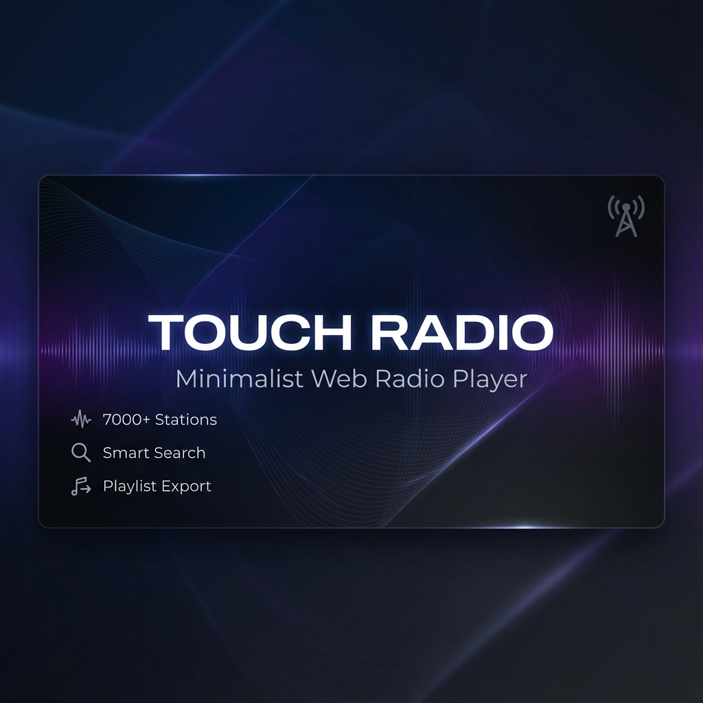

# Touch Radio

A minimalist web radio player that lets you discover and play thousands of radio stations worldwide. Built with Astro, featuring smart search, playlist export, and a clean, ad-free experience.



## ✨ Features

- 🌍 **7,000+ Radio Stations** - Worldwide coverage with diverse genres
- 🔍 **Smart Search** - Intelligent filtering by genre, country, codec, and bitrate
- 📻 **Live Preview** - Play stations directly in your browser
- 💾 **Playlist Export** - Export your selection in M3U, M3U8, PLS, or JSON formats
- 🔗 **Share Playlists** - Share your curated station lists with friends
- 🎨 **Dark Mode** - Automatic theme switching
- 📱 **Responsive Design** - Works seamlessly on desktop and mobile
- 🚫 **No Tracking** - Privacy-first, no analytics, no ads
- ⚡ **Fast & Lightweight** - Static site generation for instant loading
- 🌐 **PWA Ready** - Install as a standalone app

## 🚀 Quick Start

### Prerequisites

- Node.js 20.x or higher
- npm or pnpm

### Installation

```bash
# Clone the repository
git clone https://github.com/Morganczech/touch-radio-web.git
cd touch-radio-web

# Install dependencies
npm install

# Fetch latest station data
npm run fetch:stations

# Start development server
npm run dev
```

Visit `http://localhost:4321` to see the app in action.

### Build for Production

```bash
# Build the site
npm run build

# Preview the build
npm run preview
```

## 📦 Project Structure

```
touch-radio-web/
├── public/              # Static assets
│   ├── og-image.png    # Social media preview
│   ├── icons/          # PWA icons
│   └── manifest.json   # PWA manifest
├── scripts/            # Build scripts
│   ├── fetch-stations.mjs      # Fetch stations from Radio Browser API
│   └── normalize-stations.mjs  # Normalize station data
├── src/
│   ├── components/     # Astro components
│   ├── data/          # Station data (JSON)
│   ├── layouts/       # Page layouts
│   ├── pages/         # Routes
│   ├── scripts/       # Client-side JavaScript
│   └── styles/        # Global styles
└── package.json
```

## 🎯 Usage

### Search & Filter

- **Text Search**: Type station name, genre, or keywords
- **Smart Filters**: Use dropdowns for country, genre, and codec
- **Smart Search Syntax**: 
  - `jazz 128 us mp3` - Find US jazz stations with 128kbps MP3
  - `rock germany` - Find German rock stations
  - `classical 320` - Find high-quality classical stations

### Playlist Management

1. Click the heart icon on station cards to add to "My Selection"
2. View selected stations in the sidebar
3. Export your playlist:
   - **M3U/M3U8** - For VLC, Winamp, iTunes
   - **PLS** - For older players
   - **JSON** - Touch Radio format
4. Share your playlist via URL

### Keyboard Shortcuts

- `Ctrl/Cmd + K` - Focus search
- `Esc` - Clear search

## 🛠️ Technology Stack

- **Framework**: [Astro](https://astro.build/) - Static site generator
- **Language**: TypeScript
- **Styling**: Vanilla CSS with CSS custom properties
- **Data Source**: [Radio Browser API](https://www.radio-browser.info/)
- **Deployment**: Netlify (or any static host)

## 📡 Data Source

Station data is fetched from the [Radio Browser API](https://www.radio-browser.info/), a community-driven database of radio stations. The data is fetched at build time and stored locally for fast access.

### Update Station Data

```bash
npm run fetch:stations
```

This fetches the top 5,000 voted and clicked stations, merges them, and normalizes the data.

## 🤝 Contributing

Contributions are welcome! Please feel free to submit a Pull Request.

### Development Workflow

1. Fork the repository
2. Create a feature branch (`git checkout -b feature/amazing-feature`)
3. Commit your changes (`git commit -m 'add: amazing feature'`)
4. Push to the branch (`git push origin feature/amazing-feature`)
5. Open a Pull Request

### Commit Convention

We use semantic commit messages:
- `add:` - New features
- `update:` - Updates to existing features
- `fix:` - Bug fixes
- `refactor:` - Code refactoring
- `docs:` - Documentation changes
- `chore:` - Maintenance tasks

## 📄 License

This project is licensed under the MIT License - see the [LICENSE](LICENSE) file for details.

## 🙏 Acknowledgments

- [Radio Browser](https://www.radio-browser.info/) - For providing the station database
- [Astro](https://astro.build/) - For the amazing framework
- All radio stations and broadcasters

## 📧 Contact

- GitHub: [@Morganczech](https://github.com/Morganczech)
- Project Link: [https://github.com/Morganczech/touch-radio-web](https://github.com/Morganczech/touch-radio-web)

---

**Touch Radio** - Discover radio, your way. 🎵
