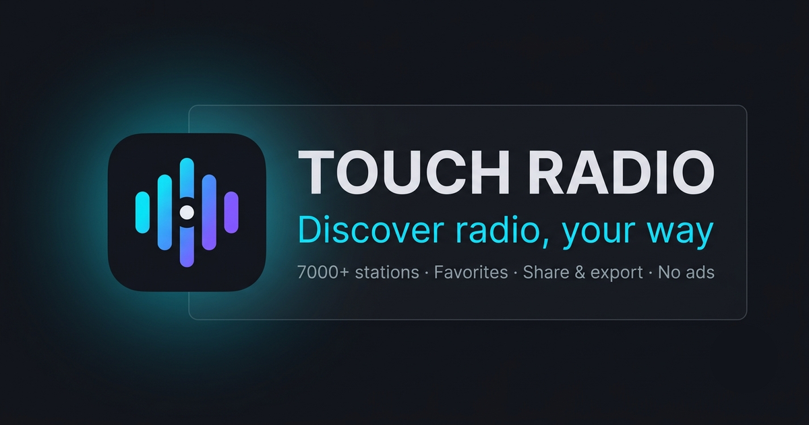

# Touch Radio

A minimalist web radio player for discovering and listening to thousands of stations worldwide. Built with Astro — smart search, favorites with share/export, a mobile-first player, and a clean ad-free experience.

**Live:** [https://touchradio.eu](https://touchradio.eu)



## Features

- **7,000+ radio stations** — worldwide coverage across genres
- **Smart search** — filter by genre, country, codec, and bitrate
- **Live playback** — stream in the browser with dock + Now Playing drawer
- **Favorites** — save stations with ♥ (stored in `localStorage`, no login)
- **Share & export** — share a favorites link, or export M3U / M3U8 / PLS / JSON
- **Sleep timer** — 5–120 minutes with countdown and fade-out before stop
- **Media Session** — lock-screen / OS media controls where supported
- **Light & dark theme** — Hi-Fi dark by default, toggle persists locally
- **Responsive PWA** — installable; works on desktop and mobile
- **Privacy-conscious** — cookie-free TOPlist visitor counting, no ads
- **Fast & static** — Astro SSG for quick loads

## Quick Start

### Prerequisites

- Node.js 20.x or higher
- npm or pnpm

### Installation

```bash
# Clone the repository
git clone https://github.com/Morganczech/touch-radio-web.git
cd touch-radio-web

# Install dependencies
npm install

# Fetch latest station data
npm run fetch:stations

# Start development server
npm run dev
```

Visit `http://localhost:4321` to see the app in action.

### Build for Production

```bash
# Build the site (also refreshes station data via prebuild)
npm run build

# Preview the build
npm run preview
```

## Project Structure

```
touch-radio-web/
├── public/                 # Static assets, PWA icons, manifest
├── scripts/                # Build-time station fetch / normalize
├── src/
│   ├── components/         # UI (header, hero, grid, player, favorites)
│   ├── data/               # Station JSON
│   ├── layouts/            # Base layout + theme bootstrap
│   ├── pages/              # Routes
│   ├── scripts/            # Client logic (player, favorites, filters)
│   └── styles/             # Design tokens + station cards
└── package.json
```

## Usage

### Search & filter

- **Text search** — station name, genre, or keywords
- **Filters** — country, genre, codec
- **Smart search syntax**:
  - `jazz 128 us mp3` — US jazz, ~128 kbps MP3
  - `rock germany` — German rock
  - `classical 320` — high-bitrate classical

### Favorites

1. Tap **♥** on a station card to save it
2. Open **Favorites** (sidebar on desktop, bottom nav / header on mobile)
3. Play, remove, or **Share Favorites Link** (URL with `?playlist=…`)
4. Export as **M3U / M3U8 / PLS / JSON**

Opening a shared link loads those stations into Favorites.

### Player

- Use the bottom **dock** for play / pause / prev / next / volume
- On mobile, tap the dock (or the up chevron) to open **Now Playing**
- Set a **Sleep timer** there — countdown shows in the dock; audio fades in the last minute, then the stream disconnects

### Keyboard shortcuts

- `Ctrl/Cmd + K` — focus search
- `Esc` — clear search

## Technology Stack

- **Framework**: [Astro](https://astro.build/)
- **Language**: TypeScript
- **Styling**: Vanilla CSS with design tokens (light/dark)
- **Fonts**: Geist, Inter, JetBrains Mono
- **Data**: [Radio Browser API](https://www.radio-browser.info/)
- **Deploy**: Netlify (or any static host)

## Data Source

Station data comes from the [Radio Browser API](https://www.radio-browser.info/). It is fetched at build time and stored locally for fast access.

### Update station data

```bash
npm run fetch:stations
```

This fetches the top voted/clicked stations, merges them, and normalizes the data.

### Automated updates

The station list is updated **daily at 4:00 AM UTC** via GitHub Actions. On a fork, enable **Read and write permissions** under `Settings → Actions → General → Workflow permissions`.

## Contributing

Contributions are welcome — feel free to open a Pull Request.

### Development workflow

1. Fork the repository
2. Create a feature branch (`git checkout -b feature/amazing-feature`)
3. Commit (`git commit -m 'add: amazing feature'`)
4. Push and open a Pull Request

### Commit convention

- `add:` — new features
- `update:` — updates to existing features
- `fix:` — bug fixes
- `refactor:` — code refactoring
- `docs:` — documentation
- `chore:` — maintenance

## License

MIT — see the [LICENSE](LICENSE) file.

## Acknowledgments

- [Radio Browser](https://www.radio-browser.info/) — station database
- [Astro](https://astro.build/) — framework
- All radio stations and broadcasters

## Contact

- GitHub: [@Morganczech](https://github.com/Morganczech)
- Project: [https://github.com/Morganczech/touch-radio-web](https://github.com/Morganczech/touch-radio-web)

---

**Touch Radio** — Discover radio, your way.
